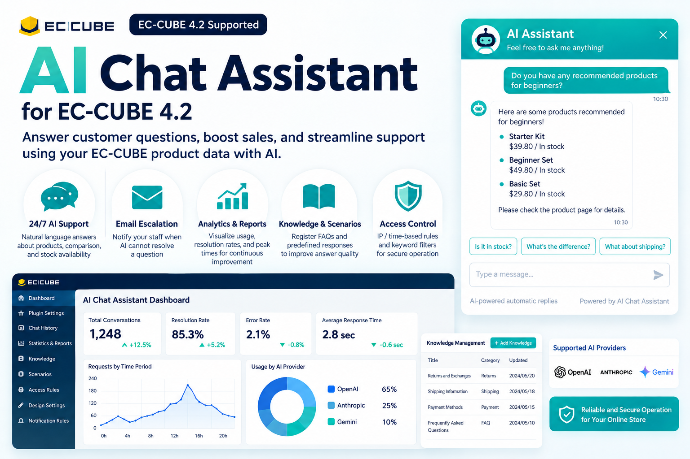

# AI チャットアシスタント for EC-CUBE 4.2/4.3




EC-CUBEの商品情報をもとに、AIが購入者からの質問に回答するチャットアシスタントプラグインです。

「この商品は在庫がありますか？」
「初心者向けの商品はありますか？」
「この2つの商品は何が違いますか？」

といった質問に、EC-CUBEの商品情報や登録したナレッジを利用して回答します。

AIだけでは解決できない問い合わせは、メールでの回答依頼へ引き継ぐこともできます。

**商品案内の自動化から、問い合わせ分析・FAQ改善までをEC-CUBEの管理画面から運用できます。**

---

## フィロソフィー

私たちが大切にしている OSS への向き合い方を、指針としてまとめたコラムです。この指針があるからこそ、日々の OSS 活動や記事の執筆を続けています。社会に積み重なった見直されない仕組みを「技術的負債」と捉え直す考え方に触れていただけるとうれしいです。

- [社会にも、技術的負債がある。| リキッド通販ショップ](https://www.thch-vape.shop/guide/column/git-log--oneline--all--society)

---

## 主な機能

### AIによる商品案内

EC-CUBEの商品情報を利用して、購入者からの商品に関する質問へ自然言語で回答します。

* 商品名
* 価格
* 在庫
* カテゴリ
* 商品検索
* 商品比較
* 複数ターンの会話

同じチャットセッション内では会話履歴を保持するため、

> 「初心者向けの商品を教えて」
> 「その中で一番安いものは？」
> 「それの在庫は？」

といった連続した質問にも対応できます。

---

### 3つのAIプロバイダに対応

以下のAIプロバイダを利用できます。

* OpenAI
* Anthropic
* Google Gemini

利用するプロバイダ・モデルは管理画面から変更できます。

モデル一覧は外部JSONから更新できるため、プラグイン本体を更新せずに新しいモデルを追加できます。

---

### AI + 定型回答のハイブリッド

すべての問い合わせをAIへ送信する必要はありません。

「返品」「送料」「営業時間」など、回答が決まっている質問にはシナリオ機能を利用できます。

```text
購入者
   ↓
問い合わせ
   ↓
シナリオに一致？
   ├─ YES → 定型回答
   │
   └─ NO → AI
              ↓
         商品情報 / ナレッジ
              ↓
             回答
```

定型質問ではAI APIを呼び出さないため、応答速度やAPIコストの改善にも利用できます。

---

## 最短セットアップ

基本的なAIチャットを開始するために、すべての機能を設定する必要はありません。

### 1. インストール

#### A. Composer からインストール（Packagist 公開後）

```bash
composer config repositories.aichatassistant42 vcs \
https://github.com/routeflags/ec-cube-ai-chat-assistant42

composer require ec-cube/aichatassistant42

php bin/console eccube:plugin:install --code=AiChatAssistant42
php bin/console eccube:plugin:enable --code=AiChatAssistant42
```

#### B. tar.gz からインストール（推奨: GitHub Release 配布）

```bash
# 1. AiChatAssistant42-1.0.0.tar.gz を EC-CUBE 本体の app/Plugin/ に展開
tar -xzf AiChatAssistant42-1.0.0.tar.gz -C /path/to/ec-cube/app/Plugin/

# 2. プラグインをインストール
php bin/console eccube:plugin:install --code=AiChatAssistant42

# 3. 管理画面で有効化（またはコマンドで有効化）
php bin/console eccube:plugin:enable --code=AiChatAssistant42
# 管理画面: コンテンツ管理 > プラグイン > AiChatAssistant42 > 有効化
```

> tar.gz は `bin/package.sh` で生成します。`vendor/` は含まないため、展開後に EC-CUBE が依存を解決します。

### 2. APIキーを設定

EC-CUBE管理画面から、

```text
設定
└── AI チャットアシスタント
    └── プラグイン設定
```

を開きます。

OpenAI / Anthropic / Google Gemini のいずれかのAPIキーを入力します。

### 3. チャットを有効化

「チャットを有効にする」をONにします。

これでフロントエンドにAIチャットウィジェットが表示されます。

**基本セットアップはこれだけです。**

ナレッジ、シナリオ、通知、アクセス制御などは必要に応じて追加設定できます。

---

## 購入者側の機能

### レスポンシブチャット

PC / スマートフォンに対応したチャットウィジェットを表示します。

表示位置、サイズ、カラー、表示名などは管理画面から変更できます。

### 会話履歴

同じセッション内では過去の会話を参照し、文脈を維持した回答ができます。

### メール回答依頼

AIチャットだけでは解決できなかった場合、購入者はメールでの回答を依頼できます。

```text
AIチャット
    ↓
解決できない
    ↓
メール回答を依頼
    ↓
店舗スタッフが対応
```

AIだけで問い合わせ対応を完結させることを前提とせず、人によるサポートへ引き継げる設計です。

---

## 管理画面

AIチャットの設定から運用状況の分析まで、EC-CUBE管理画面から行えます。

| ページ     | 主な機能                        |
| ------- | --------------------------- |
| ダッシュボード | 総会話数・解決率・エラー率・平均応答時間        |
| プラグイン設定 | AIプロバイダ・モデル・APIキー・システムプロンプト |
| チャット履歴  | 購入者とAIの会話履歴                 |
| 統計・レポート | プロバイダ別・モデル別・時間帯別分析          |
| ナレッジ管理  | FAQ・ショップ独自情報                |
| シナリオ管理  | キーワードによる定型回答                |
| アクセスルール | IP・時間帯・ブロックワード              |
| デザイン設定  | 色・サイズ・位置・表示名                |
| 通知ルール   | メール・Webhook・LINE通知          |

---

## ダッシュボード

AIチャットの運用状況を確認できます。

主なKPI：

* 総会話数
* 解決率
* エラー率
* 平均応答時間
* プロバイダ別利用状況
* 時間帯別リクエスト
* 未対応メール返信

チャットを設置するだけではなく、実際にどの程度利用され、問い合わせが解決しているかを確認できます。

---

## ナレッジ管理

EC-CUBEの商品情報だけでは回答できないショップ独自情報を登録できます。

例えば、

```text
タイトル:
返品・交換について

カテゴリ:
返品・交換

本文:
商品到着後7日以内、未開封の商品に限り返品できます。
```

と登録すると、AIが回答時のナレッジとして利用します。

利用例：

* 返品・交換
* 配送
* 送料
* 支払方法
* 商品の使い方
* ショップ独自FAQ

有効なナレッジは最大50件までAIのコンテキストへ追加されます。

---

## シナリオ管理

特定の質問に対して、AIを利用せず定型回答できます。

例：

```text
キーワード:
返品

マッチ:
部分一致

回答:
返品は商品到着後7日以内、未開封の商品に限り受け付けています。
```

マッチ方式：

| タイプ  | 動作            |
| ---- | ------------- |
| 完全一致 | 入力内容が完全に一致    |
| 部分一致 | 入力内容にキーワードを含む |
| 正規表現 | 正規表現による判定     |

複数のシナリオが一致した場合は、優先度によって回答を決定します。

---

## チャット履歴・分析

購入者とAIの会話を管理画面から確認できます。

記録される主な情報：

* ユーザー入力
* AI回答
* セッション
* AIプロバイダ
* AIモデル
* 応答時間
* トークン使用量
* エラー
* 使用したツール
* メール回答依頼

実際の質問内容を確認することで、

```text
購入者の質問
      ↓
チャット履歴
      ↓
頻出質問を発見
      ↓
ナレッジ / シナリオへ追加
      ↓
回答品質を改善
```

という運用ができます。

---

## アクセス制御

AI APIの不正利用や不要なリクエストを抑えるため、アクセスルールを設定できます。

対応ルール：

* IPアドレス
* 時間帯
* ブロックワード

また、1分間あたりのリクエスト数を制限するレートリミットにも対応しています。

---

## デザイン設定

チャットウィジェットはショップデザインに合わせて変更できます。

設定可能な項目：

* ウィジェットカラー
* サイズ
* 表示位置
* AIアシスタント表示名
* 初回メッセージ

---

## 通知

問い合わせ状況に応じて通知を設定できます。

対応：

* メール
* Webhook
* LINE

AIだけで処理せず、人による対応が必要な問い合わせを店舗運営へつなげる用途に利用できます。

---

## 必要要件

* EC-CUBE 4.2/4.3
* PHP 8.0+
* データベース
  * MySQL 5.7+ / 8.0+（本番推奨）
  * PostgreSQL 12+（EC-CUBE 4.2 準拠）
  * SQLite 3.x（開発・テスト用）
* Guzzle（EC-CUBE同梱）

> **対応 DB とバージョン**: 本プラグインの集計クエリ（時間帯別分布など）は MySQL / PostgreSQL / SQLite のいずれでも動作するように分岐しています。MySQL では `HOUR()`、PostgreSQL では `EXTRACT(HOUR FROM ...)`、SQLite では `strftime('%H', ...)` を使用します。ローカル検証は `DATABASE_URL=sqlite:///var/eccube.db` でも `500` にならないことをテストで担保しています。

---

## アーキテクチャ

```text
                    EC-CUBE
                       │
              ┌────────┴────────┐
              │                 │
          商品データ          ナレッジ
              │                 │
              └────────┬────────┘
                       │
購入者 ──→ Chat Widget ──→ Chat API
                       │
              ┌────────┴────────┐
              │                 │
           Scenario            LLM
              │                 │
         定型回答       ┌───────┼───────┐
                        │       │       │
                     OpenAI Anthropic Gemini
                        │       │       │
                        └───────┬───────┘
                                │
                              回答
                                │
                         Chat History
                                │
                         Dashboard / Report
```

---

## ディレクトリ構成

```text
AiChatAssistant42/
├── Controller/
│   ├── Admin/
│   └── Api/
├── Entity/
├── Repository/
├── Service/
│   ├── AiAgent/
│   ├── AiAgentFactory.php
│   ├── AiModelRegistry.php
│   ├── ChatLogger.php
│   ├── McpServerService.php
│   ├── NotificationService.php
│   └── AccessRuleService.php
├── EventListener/
├── Command/
├── DoctrineMigrations/
├── Resource/
│   ├── config/
│   ├── template/admin/
│   ├── template/default/
│   └── assets/
├── Nav.php
├── composer.json
├── eccube-plugin.yaml
└── README.md
```

---

## MCPサーバー

商品データは MCP サーバーとして利用できます。**STDIO** と **Web MCP（Streamable HTTP）** の 2 transport に対応しています。

### Web MCP（Streamable HTTP）— 推奨

`https://www.thch-vape.shop` で Web MCP として公開。Claude Desktop（`mcp-remote`）/ Cursor / VS Code から HTTP で接続できます。

```bash
# Discovery
curl https://www.thch-vape.shop/.well-known/mcp.json | jq '.tools | length' # → 7

# Streamable HTTP
curl -X POST https://www.thch-vape.shop/mcp \
  -H 'Content-Type: application/json' \
  -d '{"jsonrpc":"2.0","id":1,"method":"initialize","params":{"protocolVersion":"2024-11-05","capabilities":{}}}'
```

| エンドポイント | メソッド | 説明 |
|--------------|----------|------|
| `GET /.well-known/mcp.json` | GET | Discovery。`transport: streamable-http` + 7 tools の inputSchema |
| `GET /.well-known/mcp` | GET | 同上（alias） |
| `POST /mcp` | POST | JSON-RPC 2.0（`initialize` / `tools/list` / `tools/call x7`） |
| `OPTIONS /mcp` | OPTIONS | CORS preflight（`204 + ACAO: *`） |

**7 tools:** `search_products` / `get_product_detail` / `get_stock` / `get_categories` / `get_category_products` / `get_tags` / `search_by_tag`（全て read-only、匿名 `ACAO: *`、RateLimit `120/min` / `get_stock 60/min`）

Claude Desktop 設定例：

```json
{
  "mcpServers": {
    "thch-vape": {
      "command": "npx",
      "args": ["-y", "mcp-remote", "https://www.thch-vape.shop/mcp"]
    }
  }
}
```

E2E: `e2e/mcp.spec.ts` 33 tests（Playwright + `Tests/Docker/docker-compose.verify.yml`）で `E2E_BASE_URL=http://localhost:8085 npx playwright test` → `33 passed` を検証。

### STDIO（ローカル）

```bash
php bin/console app:ai-chat-assistant
```

`.mcp.json`：

```json
{
  "mcpServers": {
    "ec-product": {
      "command": "php",
      "args": [
        "bin/console",
        "app:ai-chat-assistant"
      ],
      "cwd": "/path/to/ec-cube"
    }
  }
}
```

---

## Web MCP（Streamable HTTP）

ブラウザや外部AIエージェント（Claude / ChatGPT / Cursorなど）から、HTTP経由で商品データを利用できます。コマンドの起動は不要で、URLを登録するだけです。

### エンドポイント

| 用途 | メソッド | パス | 応答 |
|---|---|---|---|
| MCP通信 | POST | `/mcp` | `initialize` / `tools/list` / `tools/call` にJSON-RPCで応答 |
| Discovery | GET | `/.well-known/mcp.json`（`/mcp` でも可） | サーバー情報＋ツール一覧 |
| プリフライト | OPTIONS | `/mcp` | CORS `204` |

サーバー名は `ec-mcp`、プロトコルバージョンは `2024-11-05` です。

### 利用できるツール（7件）

| ツール名 | 内容 |
|---|---|
| `search_products` | 商品をキーワード・カテゴリ・価格帯で検索 |
| `get_product_detail` | 商品IDから詳細（価格・説明・画像など）を取得 |
| `get_stock` | 商品IDから在庫状況を取得 |
| `get_categories` | カテゴリ一覧を取得 |
| `get_category_products` | カテゴリIDから商品一覧を取得 |
| `get_tags` | タグ一覧を取得 |
| `search_by_tag` | タグから商品を検索 |

在庫無制限の商品は在庫数を返さず `null` になります（実在庫を見せない配慮です）。

### 使い方の例

```bash
# ツール一覧の取得
curl -s -X POST https://example.com/mcp \
  -H 'Content-Type: application/json' \
  -d '{"jsonrpc":"2.0","id":1,"method":"tools/list","params":{}}'

# 商品検索の実行
curl -s -X POST https://example.com/mcp \
  -H 'Content-Type: application/json' \
  -d '{"jsonrpc":"2.0","id":2,"method":"tools/call",
       "params":{"name":"search_products","arguments":{"keyword":"リキッド"}}}'
```

### 制限と注意

* **レート制限**：IP＋ツール＋分単位で制限します（通常ツール120回/分、`get_stock` は60回/分）。超過時は `429` を返します
* **CORS**：ブラウザからの直接呼び出し（WebMCP）に対応しています
* **メソッド制限**：`GET /mcp` は `405`、JSON以外は `415` を返します
* **監査ログ**：呼び出しは監査ログに記録されます（IPはハッシュ化）。詳しくは `ADMIN_MANUAL.md` の付録を参照してください

具体的な利用フローは `USE_CASES.md` の UC-12、運用・セキュリティの詳細は `ADMIN_MANUAL.md` を参照してください。

---

## AIモデルの追加

AIモデル一覧は、

```text
Resource/config/ai_models.json
```

で管理されています。

管理画面からリモートJSON URLを設定することで、プラグイン本体を更新せずモデル情報を更新することもできます。

---

## 詳細ドキュメント

より詳しい管理画面の操作方法については、

`ADMIN_MANUAL.md`

を参照してください。

具体的な利用フローや動作例については、

`USE_CASES.md`

を参照してください。

---

## アンインストール

```bash
php bin/console eccube:plugin:uninstall --code=AiChatAssistant42
```

---

## License

GPL-2.0-only License

